# pSQL_AWS_pypark
---
- #### Summary: This Project extracts structured and semi-structured data from multiple sources including files and Web APIs, explores the data using a query engine, transforms the data for consistency and analysis, loads the data into a normalized relational database, analyzes the data with SQL, and visualizes the data with simple charts, such as pie charts and histograms. 
---
- #### The pipeline will be built on AWS with the following software stack: SQL, Presto, Spark, Python, Postgres, QuickSight.
---
- #### The following are ERD's that were built in this project:

- 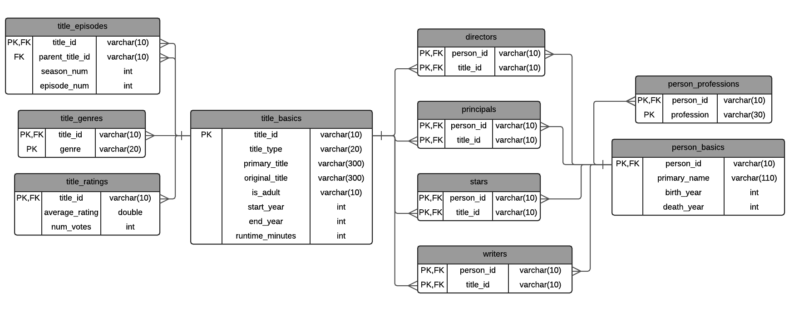

---

- 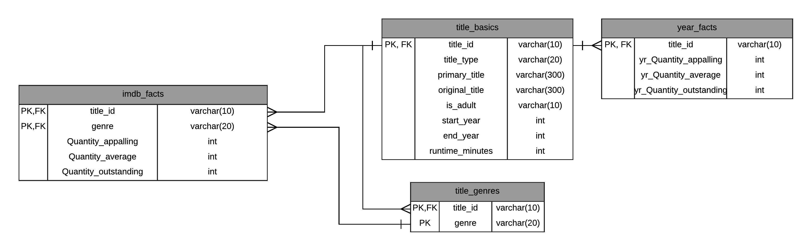

---

- 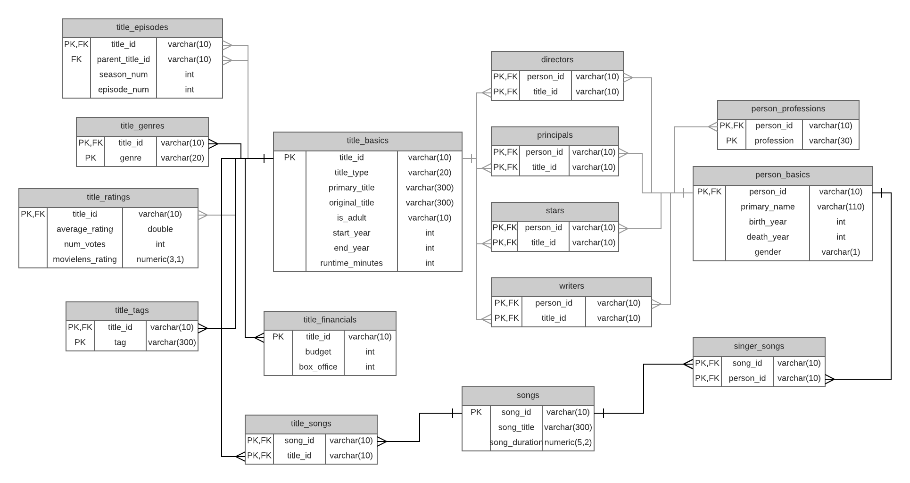

---

- #### Here are some interesting visualizations of the IMDB data.

- 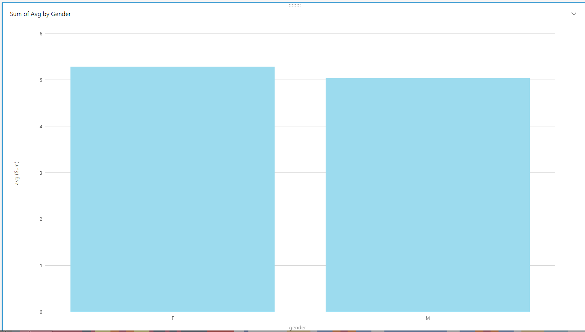

- 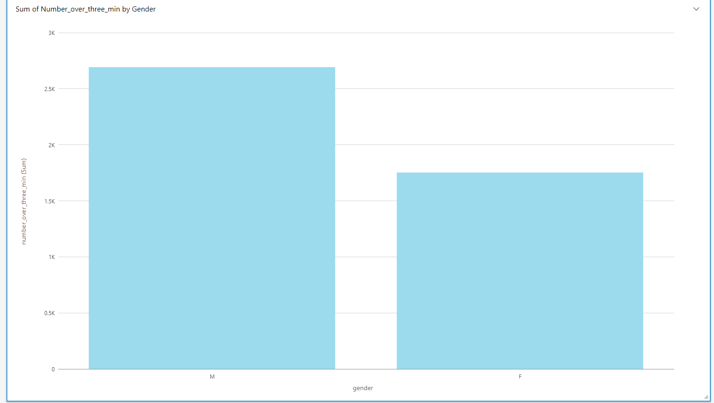

- 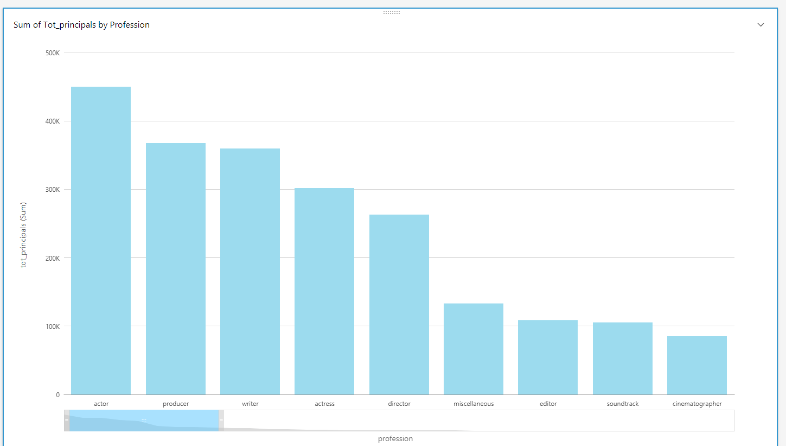

- 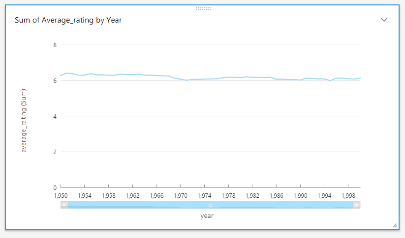

- 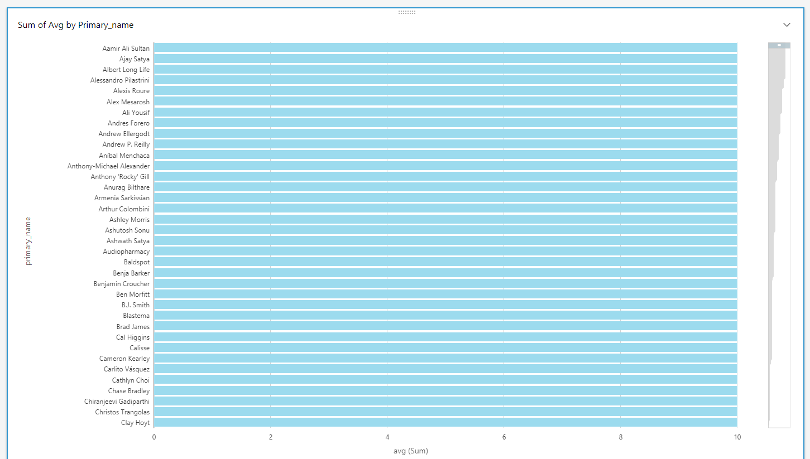

- 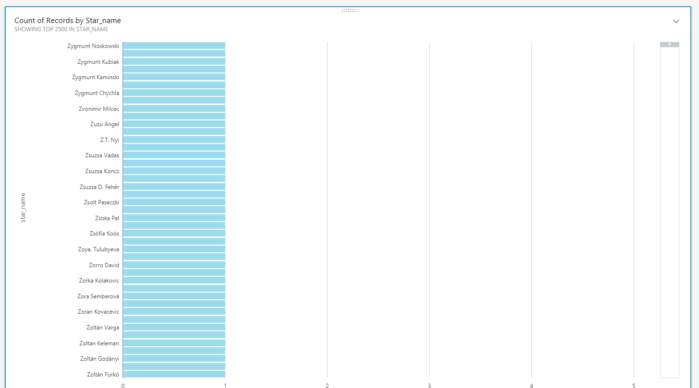

- 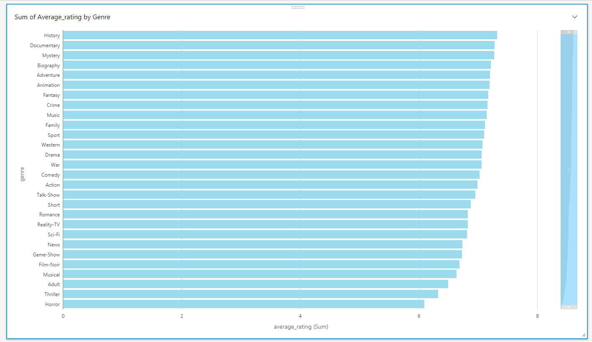

- 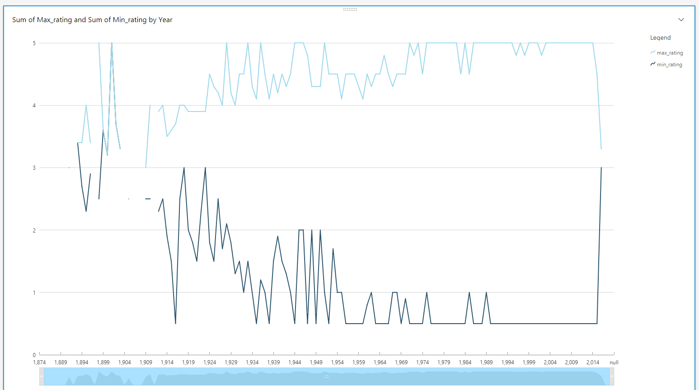

- 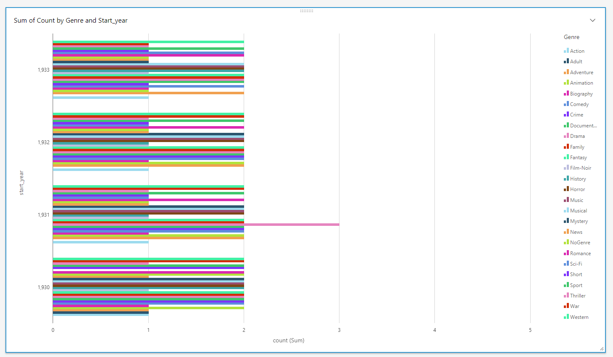

- 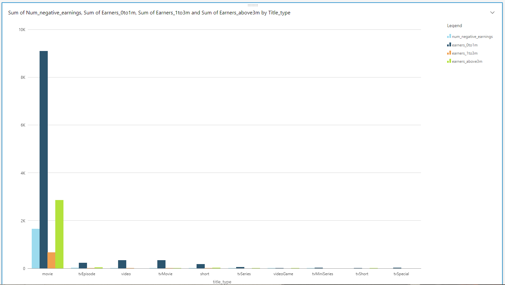

- 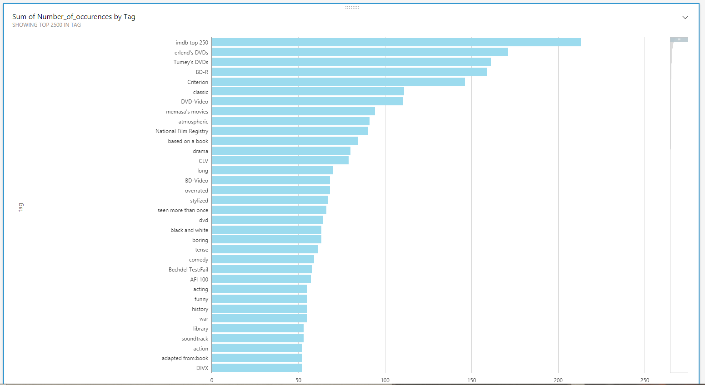

- 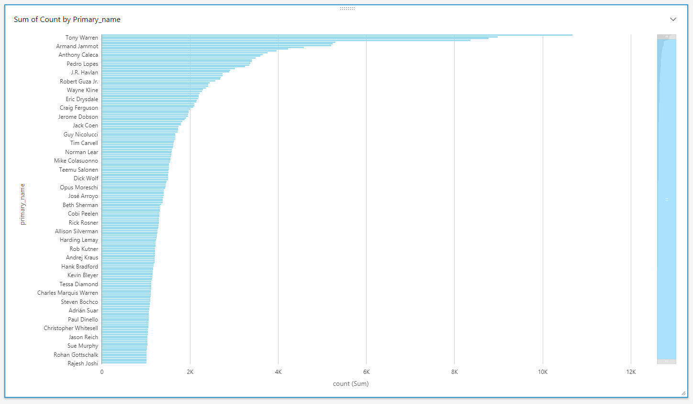

---

